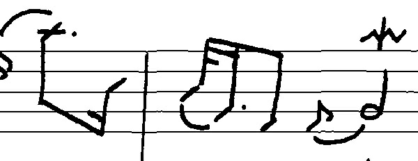
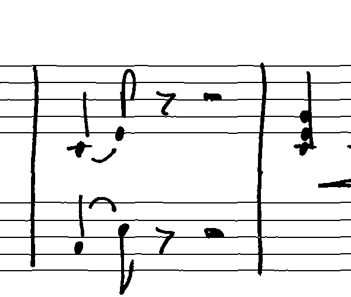
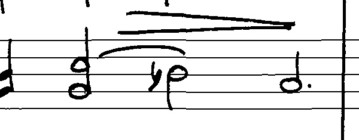
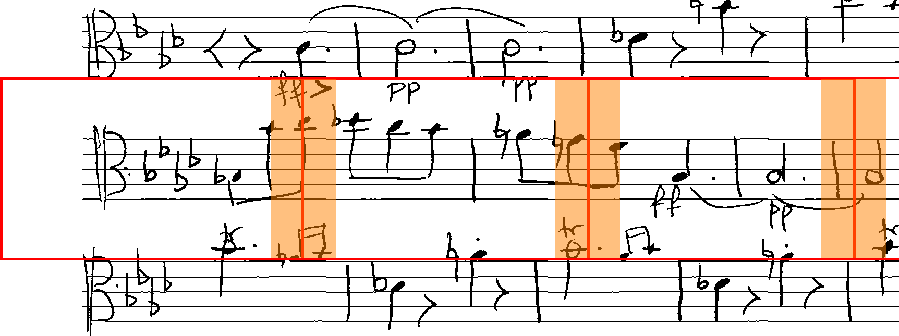

# Music Object Detector

This is the repository for the fast and reliable Music Symbol detector with Deep Learning, based on the Tensorflow Object Detection API: 
 
| Original Image | Detection results as training progresses |
|:--------------:|:------------------:|
|  |  |
|       |       |
|       |       |

The detailed results for various combinations of object-detector, feature-extractor, etc. can be found in [this spreadsheet](https://docs.google.com/spreadsheets/d/174-CnLO-rAoVMst0ngVGHguTlD39ebdxLX9ZLE9Pscw/edit?usp=sharing).


# Running the application
This repository contains several scripts that can be used independently of each other. 
Before running them, make sure that you have the necessary requirements installed. 

## Requirements

- Python 3.6
- Tensorflow 1.4.0 (or optionally tensorflow-gpu 1.4.0)

For installing Tensorflow and Keras we recommend using [Anaconda](https://www.continuum.io/downloads) or 
[Miniconda](https://conda.io/miniconda.html) as Python distribution (we did so for preparing Travis-CI and it worked).

To accelerate training even further, you can make use of your GPU, by installing tensorflow-gpu instead of tensorflow
via pip (note that you can only have one of them) and the required Nvidia drivers. For Windows, we recommend the
[excellent tutorial by Phil Ferriere](https://github.com/philferriere/dlwin). For Linux, we recommend using the
 official tutorials by [Tensorflow](https://www.tensorflow.org/install/) and [Keras](https://keras.io/#installation).

### Linux

See https://github.com/tensorflow/models for information 

Build the required libraries:

```commandline
cd research
protoc object_detection/protos/*.proto --python_out=.
cd slim
python setup.py install
cd ..
python setup.py install
```

### Windows
First, make sure you have [protocol buffers](https://developers.google.com/protocol-buffers/docs/downloads) installed, by heading over to [the download page](https://github.com/google/protobuf/releases/tag/v2.6.0) and download the version 3.4.0 (note that [3.5.0 does not work](https://github.com/google/protobuf/issues/3957)). Extract and copy the protoc.exe to a place, where you can run it from later on.  

```commandline
cd research
protoc object_detection/protos/*.proto --python_out=.
```

Install the python packages
```commandline
cd slim
python setup.py install
cd ..
python setup.py install
```

> If you get the exception `error: could not create 'build': Cannot create a file when that file already exists` here, delete the `BUILD` file inside first

Now add the [source to the python path](https://github.com/tensorflow/models/blob/master/research/object_detection/g3doc/installation.md#add-libraries-to-pythonpath) or just copy the `object_detection` folder and the `slim` folder into your `[Anaconda3]/Lib/site-packages` directory. 


## Dataset
If you are just interested in the dataset, the split and the annotations used in this project, you can run the following scripts to reproduce the dataset locally:

```
# cd into MusicObjectDetector folder
python muscima_image_cutter.py
python DatasetSplitter.py --source_directory=data/muscima_pp_cropped_images_with_stafflines --destination_directory=data/training_validation_test_with_stafflines
python DatasetSplitter.py --source_directory=data/muscima_pp_cropped_images_without_stafflines --destination_directory=data/training_validation_test_without_stafflines
```
  
These scripts will download the datasets automatically, generate cropped images along an Annotation.csv file and split the images into three reproducible parts for training, validation and test. 

Images will be cropped first vertically along the staffs and then horizontally (red boxes) like this (with orange regions overlapping between two regions):
 

Now you can create the Tensorflow Records that are required for actually running the training.

```
python create_muscima_tf_record.py --data_dir=data/training_validation_test_with_stafflines --set=training --annotations_dir=Annotations --output_path=data/all_classes_with_staff_lines_writer_independent_split/training.record --label_map_path=mapping_all_classes.txt
python create_muscima_tf_record.py --data_dir=data/training_validation_test_with_stafflines --set=validation --annotations_dir=Annotations --output_path=data/all_classes_with_staff_lines_writer_independent_split/validation.record --label_map_path=mapping_all_classes.txt
python create_muscima_tf_record.py --data_dir=data/training_validation_test_with_stafflines --set=test --annotations_dir=Annotations --output_path=data/all_classes_with_staff_lines_writer_independent_split/test.record --label_map_path=mapping_all_classes.txt

python create_muscima_tf_record.py --data_dir=data/training_validation_test_without_stafflines --set=training --annotations_dir=Annotations --output_path=data/all_classes_without_staff_lines_writer_independent_split/training.record --label_map_path=mapping_all_classes.txt
python create_muscima_tf_record.py --data_dir=data/training_validation_test_without_stafflines --set=validation --annotations_dir=Annotations --output_path=data/all_classes_without_staff_lines_writer_independent_split/validation.record --label_map_path=mapping_all_classes.txt
python create_muscima_tf_record.py --data_dir=data/training_validation_test_without_stafflines --set=test --annotations_dir=Annotations --output_path=data/all_classes_without_staff_lines_writer_independent_split/test.record --label_map_path=mapping_all_classes.txt
```

 If you want to use only a reduced number of classes, you can provide other mappings like `mapping_71_classes.txt`:
 
 ```
 python create_muscima_tf_record.py --data_dir=data/training_validation_test_with_stafflines --set=training --annotations_dir=Annotations --output_path=data/71_classes_with_staff_lines_writer_independent_split/training.record --label_map_path=mapping_71_classes.txt
 python create_muscima_tf_record.py --data_dir=data/training_validation_test_with_stafflines --set=validation --annotations_dir=Annotations --output_path=data/71_classes_with_staff_lines_writer_independent_split/validation.record --label_map_path=mapping_71_classes.txt
 python create_muscima_tf_record.py --data_dir=data/training_validation_test_with_stafflines --set=test --annotations_dir=Annotations --output_path=data/71_classes_with_staff_lines_writer_independent_split/test.record --label_map_path=mapping_71_classes.txt
 
 python create_muscima_tf_record.py --data_dir=data/training_validation_test_without_stafflines --set=training --annotations_dir=Annotations --output_path=data/71_classes_without_staff_lines_writer_independent_split/training.record --label_map_path=mapping_71_classes.txt
 python create_muscima_tf_record.py --data_dir=data/training_validation_test_without_stafflines --set=validation --annotations_dir=Annotations --output_path=data/71_classes_without_staff_lines_writer_independent_split/validation.record --label_map_path=mapping_71_classes.txt
 python create_muscima_tf_record.py --data_dir=data/training_validation_test_without_stafflines --set=test --annotations_dir=Annotations --output_path=data/71_classes_without_staff_lines_writer_independent_split/test.record --label_map_path=mapping_71_classes.txt
 ```
 
## Running the training
For running the training, you need to change the paths, according to your system

- in the configuration, you want to run, e.g. `configurations/faster_rcnn_inception_resnet_v2_atrous_muscima_pretrained_reduced_classes.config`
- if you use them, in the PowerShell scripts in the `training_scripts` folder.

Run the actual training script, by using the pre-defined Powershell scripts in the `training_scripts` folder, or by directly calling

```
# Start the training
python [GIT_ROOT]/research/object_detection/train.py --logtostderr --pipeline_config_path="[GIT_ROOT]/MusicObjectDetector/configurations/[SELECTED_CONFIG].config" --train_dir="[GIT_ROOT]/MusicObjectDetector/data/checkpoints-[SELECTED_CONFIG]-train"

# Start the validation
python [GIT_ROOT]/research/object_detection/eval.py --logtostderr --pipeline_config_path="[GIT_ROOT]/MusicObjectDetector/configurations/[SELECTED_CONFIG].config" --checkpoint_dir="[GIT_ROOT]/MusicObjectDetector/data/checkpoints-[SELECTED_CONFIG]-train" --eval_dir="[GIT_ROOT]/MusicObjectDetector/data/checkpoints-[SELECTED_CONFIG]-validate"
```

A few remarks: The two scripts can and should be run at the same time, to get a live evaluation during the training. The values, may be visualized by calling `tensorboard --logdir=[GIT_ROOT]/MusicObjectDetector/data`.

Notice that usually Tensorflow allocates the entire memory of your graphics card for the training. In order to run both training and validation at the same time, you might have to restrict Tensorflow from doing so, by opening `train.py` and `eval.py` and uncomment the respective (prepared) lines in the main function. E.g.:

```
gpu_options = tf.GPUOptions(per_process_gpu_memory_fraction=0.3)
sess = tf.Session(config=tf.ConfigProto(gpu_options=gpu_options))
```

### Training with pre-trained weights

It is recommended that you use pre-trained weights for known networks to speed up training and improve overall results. To do so, head over to the [Tensorflow detection model zoo](https://github.com/tensorflow/models/blob/master/research/object_detection/g3doc/detection_model_zoo.md), download and unzip the respective trained model, e.g. `faster_rcnn_inception_resnet_v2_atrous_coco` for reproducing the best results, we obtained. The path to the unzipped files, must be specified inside of the configuration in the `train_config`-section, e.g.

```json
train-config: {
  fine_tune_checkpoint: "C:/Users/Alex/Repositories/MusicObjectDetector-TF/MusicObjectDetector/data/faster_rcnn_inception_resnet_v2_atrous_coco_2017_11_08/model.ckpt"
  from_detection_checkpoint: true
}
```

> Note that inside that folder, there is no actual file, called `model.ckpt`, but multiple files called `model.ckpt.[something]`.

# Dimension clustering

For optimizing the performance of the detector, we adopted the dimensions clustering algorithm, proposed in the [YOLO 9000 paper](https://arxiv.org/abs/1612.08242).
While preparing the dataset, the `muscima_image_cutter.py` script created a file called `Annotations.csv` and a folder called `Annotations`. 
Both will contain the same annotations, but in different formats. While the csv-file contains all annotations in a plain list, the Annotations
folder contains one xml-file per image, complying with the format used for the [Pascal VOC project](http://host.robots.ox.ac.uk/pascal/VOC/).

To perform dimension clustering on the cropped images, run the following scripts:
```
python generate_muscima_statistics.py
python muscima_dimension_clustering.py
```
The first script will load all annotations and create four csv-files containing the dimensions for each annotation 
from all images, including their relative sizes, compared to the entire image.
The second script loads those statistics and performs dimension clustering, use a k-means algorithm on the relative 
dimensions of annotations.   

# License

Published under MIT License,

Copyright (c) 2018 [Alexander Pacha](http://alexanderpacha.com), [TU Wien](https://www.ims.tuwien.ac.at/people/alexander-pacha) and Kwon-Young Choi

Permission is hereby granted, free of charge, to any person obtaining a copy
of this software and associated documentation files (the "Software"), to deal
in the Software without restriction, including without limitation the rights
to use, copy, modify, merge, publish, distribute, sublicense, and/or sell
copies of the Software, and to permit persons to whom the Software is
furnished to do so, subject to the following conditions:

The above copyright notice and this permission notice shall be included in all
copies or substantial portions of the Software.

THE SOFTWARE IS PROVIDED "AS IS", WITHOUT WARRANTY OF ANY KIND, EXPRESS OR
IMPLIED, INCLUDING BUT NOT LIMITED TO THE WARRANTIES OF MERCHANTABILITY,
FITNESS FOR A PARTICULAR PURPOSE AND NONINFRINGEMENT. IN NO EVENT SHALL THE
AUTHORS OR COPYRIGHT HOLDERS BE LIABLE FOR ANY CLAIM, DAMAGES OR OTHER
LIABILITY, WHETHER IN AN ACTION OF CONTRACT, TORT OR OTHERWISE, ARISING FROM,
OUT OF OR IN CONNECTION WITH THE SOFTWARE OR THE USE OR OTHER DEALINGS IN THE
SOFTWARE.
